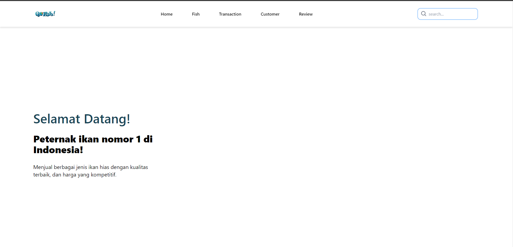
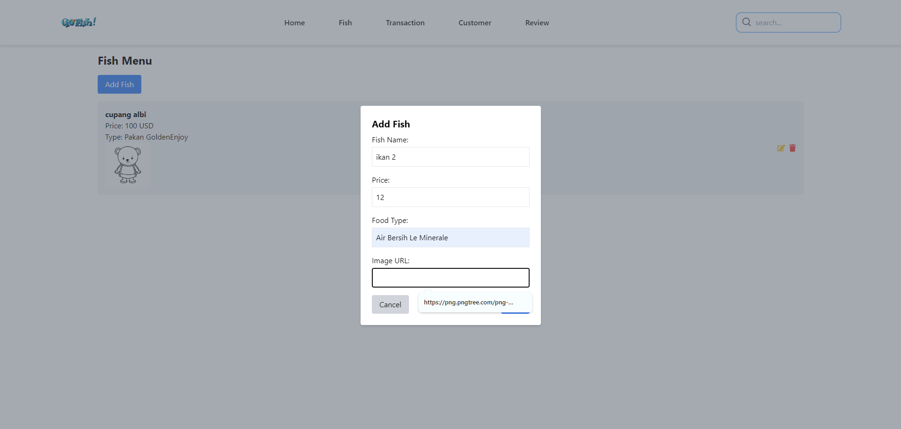
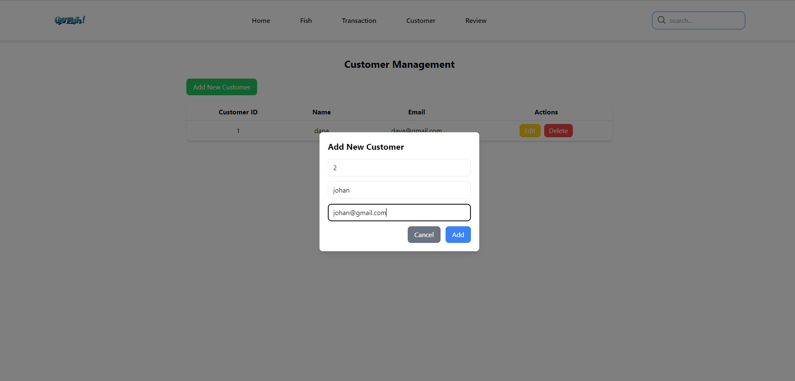
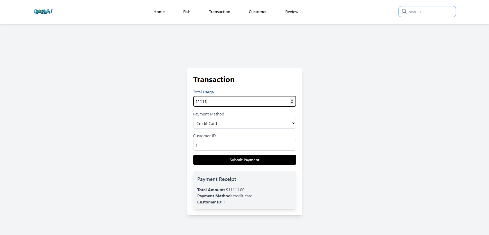

# PROJECT UTS FRONT END

Kali ini saya membuat tugas UTS Front End yaitu <b>Manajemen Toko Ikan</b> dengan menggunakan library React JS, EXPRESS JS, React Router DOM untuk melakukan routing, AXIOS untuk melakukan fetching data dan menggunakan Tailwind CSS untuk memberikan responsive pada tampilan web.

## FEATURES

- Responsive design for mobile, tablet, dan desktop views.
- Integrasi dengan Rest API untuk fetching data.

### YANG DIGUNAKAN

- <b>React</b> - JavaScript library for building user interfaces.
- <b>Tailwind CSS</b> - A utility-first CSS framework.
- <b>Axios</b> - Promise-based HTTP client for API requests.
- <b>React Router DOM</b> - A library for routing in React applications, providing a way to navigate between different components or pages within a web application.

## ROUTING AKSES :

- /fish
- /Transaction
- /Customer
- /review
- /pakan

## SCREENSHOT

Berikut hasil screenshot dari tampilan yang telah dibuat :

1. <b>Halaman Awal.</b> https://ayamkeren.github.io/UTS-DAVA-FE/
2. <b>Halaman Table Ikan</b> - Data Ikan. https://ayamkeren.github.io/UTS-DAVA-FE/fish 
3. <b>Halaman Customer</b> - Data Customer. https://ayamkeren.github.io/UTS-DAVA-FE/customer 
4. <b>Halaman Transaksi</b> - Data Transaksi https://ayamkeren.github.io/UTS-DAVA-FE/transaction 

#### NOTE :

<b>Still Learning</b>

#### THANK YOU
